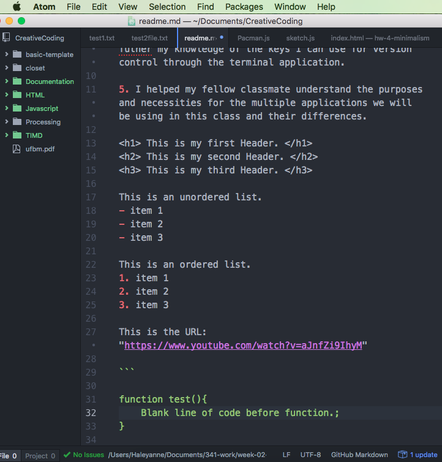

Haley Tatalovich 50

1. I installed git on my Mac. I used git in terminal to add and commit new files as well as pull changes to my branch.

2. I took the steps needed to first install git through terminal and then I cloned my already existing repository on github.com. Since I already had Atom and SourceTree installed from a previous class, I decided to install git to explore a new avenue of committing files and using a different VCS. After I installed git and initialized a new local repository and cloned my github.com master tree to git, I created a few different files all while checking the git status and git log to observe my changes.

3. I didn't have many issues after I watched Musick's video. I tried to add the wildcard key ( * ). Also, I tried to add the license, but I had realized that I didn't have a git initialized yet, so that makes sense why I couldn't track any of my files.

4. I learned a little bit about the wildcard key and want to discuss that more as well as the license and what the purpose of that is. Also, I would like to futher my knowledge of the keys I can use for version control through the terminal application.

5. I helped my fellow classmate understand the purposes and necessities for the multiple applications we will be using in this class and their differences.

<h1> This is my first Header. </h1>
<h2> This is my second Header. </h2>
<h3> This is my third Header. </h3>

This is an unordered list.
- item 1
- item 2
- item 3

This is an ordered list.
1. item 1
2. item 2
3. item 3

Extra item!!

This is the URL: "https://www.youtube.com/watch?v=aJnfZi9IhyM"

```

function test(){
    Blank line of code before function.;
}

```

